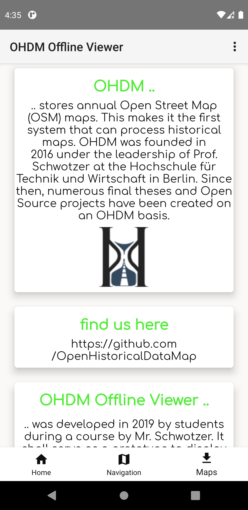

# OHDM Offline Viewer
> View OHDM maps offline
 




        
## Goal of this project
The goal of this repository is to render [Open Street Maps](https://www.openstreetmap.de/), without the need of a network connection.
To avoid caching dozens of different zoom layers, vector tiles are being used. This makes the navigation and zoom interaction fast.

## Getting Started
*Follow these instructions to build and run the OHDM Offline Viewer*
1. ```git clone https://github.com/OpenHistoricalDataMap/OfflineViewer.git```
2. [Install Android Studio](https://developer.android.com/sdk/index.html).
3. [Downlaod Open Historical Data maps](http://www.ohdm.net/)
4. Import the project. Open Android Studio, click `Open an existing Android
   Studio project` and select the project. Gradle will build the project.
4. Connect your Android Device with your Computer.
5. Run the app. Click `Run > Run 'app'`. After the project builds you'll be
   prompted to build or launch an emulator. You then can choose your mobile phone. 
6. Open ```View > Tool Windows > Device File Explorer``` and place your maps in your mobile phone device storage. There should be a ```OHDM``` (In the android emulator, you may have to create it: `Device Explorerer > sdcard > New`) directory in the internal storage. 

## Convert ```.osm``` to ```.map```-files
We're using [osmosis](https://github.com/openstreetmap/osmosis) with the [mapsforge-map-writer-plugin](https://github.com/mapsforge/mapsforge/blob/master/docs/Getting-Started-Map-Writer.md)
to convert ```.osm``` maps to ```.map```.

In order to use ```osmosis```, just execute ```/osm2map/osm2map.sh``` as sudo.

**The following code-block shows a successful execution:**
```
user@host:~$ sudo bash osm2map.sh 

Downloading osmosis to /opt/osmosis.
...

Downloading mapwriter plugin /opt/osmosis.
...

Download and build successful finished.
  
osmosis usage:
    /opt/osmosis/bin/osmosis --rx file=path-to-osm-file.osm --mw file=destination-path-map-file.map

```

Then you can begin to convert your own ```map-files``` with:
```
/opt/osmosis/bin/osmosis --rx file=path-to-osm-file.osm --mw file=destination-path-map-file.map
```

## Use custom map-file download center
This application has an integrated download functionality for map files. 
This makes it possible to host various map files on a remote server. 
You then can easily download them using the app. 
The following steps will guide you through the installation and configuration:

**WARNING:** At this point of development, the download center is a simple FTP server that does not meet any security requirements.
Using it in productivity, will make your server extremely vulnerable.


### Prerequisites
We're using ```docker``` and ```docker-compose``` to run the FTP server.

Go through the [official documentation](https://docs.docker.com/install/) in order to get both components installed.

### Build 
Open ```map-file-download-center/docker-compose.yml``` and change the ```environment``` variables to your needs:
In this example, every file in `/opt/ohdm/` will be shown in the android application. Make sure, that there are actually `map-files` in the directory you specified under `volumes` in the `docker-compose.yml`.

```
version: "3.3"
services:
  vsftpd:
    container_name: vsftpd
    image: panubo/vsftpd
    ports:
      - "21:21"
      - "4559-4564:4559-4564"
    restart: always
    environment:
      FTP_USER: ohdm
      FTP_PASSWORD: ohdm
      FTP_USERS_ROOT: 
    network_mode: "host"
    volumes:
      - /opt/ohdm:/srv/ohdm

```

Now you can start the container with

```
docker-compose up
```

If successful, you should see 

```
...
vsftpd    | Received SIGINT or SIGTERM. Shutting down vsftpd
vsftpd    | Running vsftpd
``` 
at the end of the output. 
Great, now you can begin to adjust the source code to point the app to your ftp server

### Configure 
Open the file ```app/src/main/java/de/htwBerlin/ois/Activities/MapDownloadActivity.java```:

and change the parameter with the values you just used in the ```docker-compose``` file:

``` 
...
private static final String FTP_SERVER_IP = "";
private static final Integer FTP_PORT = 21;
private static final String FTP_USER = "";
private static final String FTP_PASSWORD = "";
...
```

### Deploy
Just install the application again on your device with Android Studio.

In order to host ```map```-files on the FTP server, just copy the files to ```/opt/ohdm/```

You then should see the listed files in the ```Maps``` tab.

You can start the container with ```docker-compose up -d``` in background.

## Contact
Developed by: [FalcoSuessgott](https://github.com/FalcoSuessgott)

Project Link: [Open Historical Data Map](https://github.com/OpenHistoricalDataMap)

Institution: [HTW Berlin](https://www.htw-berlin.de/)

Mail: [info@ohdm.net](info@ohdm.net)
 
